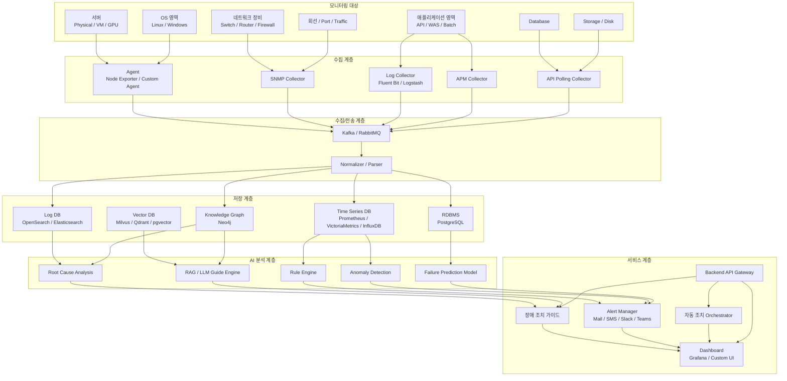
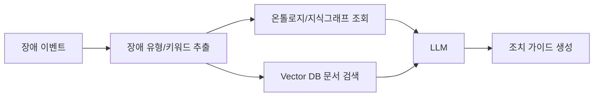

# AI 기반 통합 인프라 모니터링 및 장애 예측 플랫폼 설계서

## 1. 목표

본 문서는 네트워크 스위치, 회선, 서버, 스토리지, 내장 디스크, CPU, 메모리, OS, 미들웨어, 애플리케이션까지 전반적인 IT 인프라 상태를 통합 모니터링하고, 장애 징후를 사전에 감지하며, 대시보드와 장애 조치 가이드를 제공하는 시스템 개발 방안을 정의한다.

최종 목표는 다음과 같다.

```text
인프라 전체 상태 수집
→ 실시간 모니터링
→ 이상 징후 감지
→ 장애 예측
→ 원인 분석
→ 조치 가이드 제공
→ 필요 시 자동 조치
```

---

## 2. 시스템 범위

### 2.1 모니터링 대상

| 구분 | 대상 |
|---|---|
| 네트워크 | 스위치, 라우터, 방화벽, L4/L7, 회선, 포트, 트래픽 |
| 서버 | 물리 서버, VM, BareMetal, GPU 서버 |
| OS | Linux, Windows Server |
| 자원 | CPU, Memory, Disk, Network, GPU |
| 스토리지 | SAN, NAS, Object Storage, Local Disk |
| 데이터베이스 | Oracle, MySQL, PostgreSQL, MSSQL, MongoDB 등 |
| 미들웨어 | WAS, Nginx, Apache, Kafka, Redis 등 |
| 애플리케이션 | 업무 시스템, API 서버, 배치, Spring Boot, FastAPI 등 |
| 보안 | 인증서, 계정, 접근 로그, 취약 이벤트 |
| 로그 | 시스템 로그, 애플리케이션 로그, 장비 로그 |

---

## 3. 전체 아키텍처



---

## 4. 계층별 역할

## 4.1 모니터링 대상 계층

실제 관제 대상이 되는 모든 인프라와 애플리케이션 영역이다.

### 주요 대상

```text
네트워크 장비
서버
OS
스토리지
내장 디스크
CPU
메모리
GPU
DB
미들웨어
애플리케이션
로그
보안 이벤트
```

---

## 4.2 수집 계층

각 대상에서 상태 데이터를 수집한다.

### 수집 방식

| 방식 | 설명 | 대상 |
|---|---|---|
| Agent 방식 | 서버 내부에 에이전트 설치 | CPU, Memory, Disk, Process |
| SNMP 방식 | 네트워크 장비 상태 수집 | Switch, Router, Firewall |
| Log 방식 | 로그 파일 수집 | OS Log, App Log, DB Log |
| API 방식 | 장비/시스템 API 호출 | Storage, Cloud, DB |
| APM 방식 | 애플리케이션 성능 수집 | API latency, TPS, Error |

### 추천 도구

```text
Node Exporter
Windows Exporter
Telegraf
Fluent Bit
Logstash
OpenTelemetry Collector
SNMP Exporter
Custom Python Agent
```

---

## 4.3 데이터 전송 계층

수집된 데이터를 안정적으로 전달한다.

### 역할

```text
수집 데이터 버퍼링
대량 이벤트 처리
데이터 유실 방지
실시간 스트리밍
수집 시스템과 분석 시스템 분리
```

### 추천 기술

```text
Kafka
RabbitMQ
Redis Stream
NATS
```

대규모 환경에서는 Kafka를 추천한다.

---

## 4.4 정규화 계층

장비와 시스템마다 다른 데이터 형식을 공통 구조로 변환한다.

### 예시

서버 CPU 사용률 원본 데이터:

```json
{
  "host": "server-01",
  "cpu_idle": 12.5
}
```

정규화 후:

```json
{
  "resource_type": "server",
  "resource_id": "server-01",
  "metric_name": "cpu_usage",
  "metric_value": 87.5,
  "unit": "%",
  "timestamp": "2026-04-29T10:00:00+09:00"
}
```

---

## 4.5 저장 계층

데이터 유형별로 저장소를 분리한다.

| 저장소 | 저장 데이터 | 추천 기술 |
|---|---|---|
| Time Series DB | CPU, Memory, Disk, Traffic | Prometheus, VictoriaMetrics, InfluxDB |
| Log DB | 시스템/앱/장비 로그 | OpenSearch, Elasticsearch |
| RDBMS | 자산, 임계치, 사용자, 장애 이력 | PostgreSQL |
| Vector DB | 매뉴얼, 장애 조치 문서, FAQ | Qdrant, Milvus, pgvector |
| Knowledge Graph | 장애-원인-조치 관계 | Neo4j |

---

## 5. AI 분석 계층

## 5.1 Rule Engine

명확한 기준이 있는 장애를 판단한다.

예시:

```text
CPU 사용률 > 90% 5분 지속 → CPU 과부하 경고
Disk 사용률 > 85% → 디스크 용량 경고
Memory 사용률 > 95% → 메모리 부족 위험
NIC Error 증가 → 네트워크 포트 이상
```

---

## 5.2 이상 징후 감지

정해진 임계치가 아니라 평소 패턴과 다른 상태를 감지한다.

예시:

```text
평소 CPU 사용률 20~30%
오늘 같은 시간대 CPU 사용률 75%
→ 임계치 90%는 넘지 않았지만 이상 징후로 판단
```

### 적용 알고리즘

```text
Moving Average
Z-Score
Isolation Forest
Prophet
LSTM AutoEncoder
Anomaly Transformer
```

---

## 5.3 장애 예측 모델

과거 장애 이력과 현재 메트릭을 기반으로 장애 가능성을 예측한다.

예시:

```text
Disk 사용률 증가 속도 기준 3일 후 95% 도달 예상
→ 디스크 용량 장애 예측
```

또는:

```text
Memory 사용률 상승
Swap 증가
GC Time 증가
API Latency 증가
→ 애플리케이션 장애 가능성 높음
```

---

## 5.4 Root Cause Analysis

장애가 발생했을 때 원인 후보를 자동으로 추적한다.

예시:

```text
사용자 응답 지연 발생
→ API Latency 증가
→ DB Query Time 증가
→ DB CPU 증가
→ Storage I/O Wait 증가
→ 스토리지 지연 가능성
```

---

## 5.5 RAG 기반 장애 조치 가이드

장애 발생 시 관련 매뉴얼, 과거 조치 이력, 운영 문서를 검색해 조치 가이드를 생성한다.



### 예시 답변

```text
장애 유형: DB 응답 지연
원인 후보:
1. DB CPU 사용률 증가
2. Lock 대기 증가
3. Storage I/O 지연

권장 조치:
1. 현재 실행 중인 Long Query 확인
2. Lock Session 확인
3. Storage IOPS/Latency 확인
4. 필요 시 Read Replica 또는 Connection Pool 조정
```

---

## 6. 온톨로지 / 지식그래프 설계

장애 예측과 조치 가이드를 고도화하려면 장애-원인-조치 관계를 구조화해야 한다.

### 6.1 핵심 클래스

```text
Resource
Metric
Event
Alert
Incident
Cause
Action
Application
Server
NetworkDevice
Storage
Database
Owner
Document
```

### 6.2 핵심 관계

| 관계 | 의미 |
|---|---|
| occursIn | 장애가 발생한 위치 |
| causedBy | 장애 원인 |
| indicatedBy | 장애를 나타내는 지표 |
| resolvedBy | 해결 조치 |
| dependsOn | 의존 관계 |
| runsOn | 애플리케이션 실행 위치 |
| connectedTo | 네트워크 연결 관계 |
| ownedBy | 담당자/부서 |
| documentedIn | 관련 문서 |

### 6.3 예시 그래프

```text
API_Latency_High
 → occursIn
Order_API_Server

Order_API_Server
 → dependsOn
Order_DB

Order_DB_Slow_Query
 → causedBy
DB_CPU_High

DB_CPU_High
 → indicatedBy
cpu_usage > 90%

DB_CPU_High
 → resolvedBy
Long_Query_Kill_or_Index_Tuning
```

---

## 7. 주요 기능 정의

## 7.1 통합 대시보드

### 기능

```text
전체 인프라 상태 요약
서비스별 Health Score
장비별 상태
장애 발생 현황
장애 예측 현황
위험 자원 Top N
리소스 사용률 추이
장애 조치 가이드 표시
```

---

## 7.2 실시간 알림

### 알림 채널

```text
Email
SMS
Slack
Teams
Kakao 알림톡
Webhook
```

### 알림 예시

```text
[Critical] server-01 디스크 사용률 92%
예상 장애: 12시간 내 디스크 Full 가능성
권장 조치: 로그 파일 정리 또는 디스크 증설
```

---

## 7.3 장애 예측

### 예측 대상

```text
디스크 Full
CPU 과부하
메모리 부족
네트워크 포트 장애
회선 대역폭 포화
스토리지 I/O 지연
DB 응답 지연
API 장애
인증서 만료
```

---

## 7.4 장애 조치 가이드

### 제공 내용

```text
장애 요약
원인 후보
영향 범위
확인 명령어
조치 절차
롤백 절차
담당자
관련 문서
과거 유사 장애 사례
```

---

## 7.5 자동 조치

초기에는 권고형으로 시작하고, 안정화 후 자동 조치로 확장한다.

### 자동 조치 예시

```text
서비스 재시작
디스크 로그 정리
Pod 재시작
Auto Scaling
DB Connection Pool 조정
임계치 초과 시 트래픽 우회
인증서 만료 알림
```

주의:

```text
자동 조치는 반드시 승인 기반으로 시작한다.
Critical 시스템에는 즉시 자동 조치 금지.
Runbook 검증 후 단계적으로 적용한다.
```

---

## 8. 개발 단계별 추진 방안

## 8.1 1단계: 기본 모니터링 PoC

### 기간

```text
4~6주
```

### 목표

```text
서버/OS/CPU/Memory/Disk/Network 기본 수집
Prometheus + Grafana 대시보드 구성
기본 임계치 알림 구현
```

### 산출물

```text
Agent 설치 가이드
Metric 수집 구조
Grafana Dashboard
기본 Alert Rule
```

---

## 8.2 2단계: 로그/애플리케이션 모니터링

### 목표

```text
애플리케이션 로그 수집
API Latency / Error Rate 수집
DB 상태 수집
OpenSearch 기반 로그 검색
```

### 산출물

```text
Log Pipeline
APM Dashboard
서비스별 장애 추적 화면
```

---

## 8.3 3단계: 장애 예측 AI

### 목표

```text
이상 징후 감지 모델 적용
장애 발생 가능성 예측
예측 결과 대시보드 표시
```

### 산출물

```text
Anomaly Detection Model
Failure Prediction API
Risk Score Dashboard
```

---

## 8.4 4단계: RAG 기반 조치 가이드

### 목표

```text
장애 매뉴얼/운영 문서 Vector DB 적재
장애 유형별 조치 가이드 생성
과거 장애 사례 기반 추천
```

### 산출물

```text
Vector DB
RAG API
조치 가이드 화면
장애 대응 챗봇
```

---

## 8.5 5단계: 온톨로지/지식그래프 확장

### 목표

```text
장애-원인-조치 관계 구조화
서비스 의존성 그래프 구성
Root Cause Analysis 고도화
```

### 산출물

```text
Neo4j Knowledge Graph
서비스 영향도 분석
원인 분석 엔진
```

---

## 8.6 6단계: 자동 조치

### 목표

```text
Runbook 기반 자동 조치
승인형 자동화
조치 결과 추적
```

### 산출물

```text
Automation Orchestrator
Approval Workflow
Action History
Rollback Guide
```

---

## 9. 추천 기술 스택

| 영역 | 추천 기술 |
|---|---|
| Agent | Node Exporter, Telegraf, Custom Python Agent |
| 로그 수집 | Fluent Bit, Logstash, OpenTelemetry Collector |
| 메시지 큐 | Kafka, RabbitMQ |
| Metric 저장 | Prometheus, VictoriaMetrics, InfluxDB |
| 로그 저장 | OpenSearch, Elasticsearch |
| RDBMS | PostgreSQL |
| Vector DB | Qdrant, Milvus, pgvector |
| Graph DB | Neo4j |
| Backend | FastAPI, Spring Boot |
| Frontend | React, Next.js |
| Dashboard | Grafana, Custom Dashboard |
| AI/ML | Python, PyTorch, scikit-learn, Prophet |
| LLM/RAG | LangChain, LlamaIndex, vLLM, OpenAI-compatible API |
| 자동화 | Ansible, Rundeck, AWX, Argo Workflows |
| 배포 | Docker, Kubernetes |

---

## 10. 데이터 모델 예시

## 10.1 Resource

```json
{
  "resource_id": "server-01",
  "resource_type": "server",
  "hostname": "server-01",
  "ip": "192.168.10.11",
  "os": "Ubuntu 22.04",
  "owner": "infra-team",
  "location": "IDC-A-RACK-03"
}
```

## 10.2 Metric

```json
{
  "resource_id": "server-01",
  "metric_name": "cpu_usage",
  "value": 87.5,
  "unit": "%",
  "timestamp": "2026-04-29T10:00:00+09:00"
}
```

## 10.3 Alert

```json
{
  "alert_id": "ALT-20260429-001",
  "severity": "warning",
  "resource_id": "server-01",
  "metric_name": "cpu_usage",
  "message": "CPU 사용률이 5분 이상 85%를 초과했습니다.",
  "status": "open"
}
```

## 10.4 Incident

```json
{
  "incident_id": "INC-20260429-001",
  "title": "Order API 응답 지연",
  "severity": "critical",
  "affected_service": "Order API",
  "root_cause": "DB CPU High",
  "recommended_action": "Long Query 확인 및 Index 튜닝"
}
```

---

## 11. 장애 예측 점수 모델

장애 위험도를 0~100점으로 산정한다.

```text
Risk Score = Resource Usage Score
           + Trend Score
           + Anomaly Score
           + Historical Incident Score
           + Dependency Impact Score
```

### 예시

| 항목 | 점수 |
|---|---:|
| CPU 사용률 | 25 |
| Memory 사용률 | 20 |
| Disk 증가 추세 | 15 |
| 이상 징후 | 20 |
| 과거 장애 이력 | 10 |
| 총점 | 90 |

결과:

```text
Risk Score 90 = Critical
즉시 조치 필요
```

---

## 12. 장애 조치 가이드 템플릿

```markdown
# 장애 조치 가이드

## 장애 요약
- 장애명:
- 발생 시스템:
- 심각도:
- 감지 시간:

## 주요 증상
- CPU 증가
- 응답 지연
- Error Rate 증가

## 원인 후보
1. 애플리케이션 과부하
2. DB 지연
3. 네트워크 지연

## 확인 명령어
```bash
top
df -h
free -m
iostat -x 1
netstat -anp
```

## 조치 절차
1. 영향 서비스 확인
2. 리소스 사용률 확인
3. 최근 배포 여부 확인
4. 로그 확인
5. 필요 시 서비스 재시작

## 롤백 절차
1. 최근 변경사항 확인
2. 이전 버전 재배포
3. 상태 확인

## 담당자
- 1차 담당:
- 2차 담당:
- 관련 부서:
```

---

## 13. API 설계 예시

### Metric 조회

```http
GET /api/v1/metrics?resource_id=server-01&metric=cpu_usage
```

### Alert 조회

```http
GET /api/v1/alerts?status=open
```

### 장애 예측 조회

```http
GET /api/v1/predictions?resource_id=server-01
```

### 조치 가이드 생성

```http
POST /api/v1/guides/generate
Content-Type: application/json

{
  "alert_id": "ALT-20260429-001",
  "resource_id": "server-01",
  "symptom": "CPU High and API Latency Increased"
}
```

---

## 14. 개발 우선순위

```text
1. 자산 관리 모델 정의
2. Metric 수집 Agent 개발/도입
3. Metric 저장소 구축
4. 기본 대시보드 구축
5. Alert Rule Engine 개발
6. 로그 수집 파이프라인 구축
7. 장애 이력 DB 구축
8. 이상 징후 감지 모델 개발
9. RAG 기반 조치 가이드 개발
10. 지식그래프 기반 원인 분석 개발
11. 자동 조치 기능 개발
```

---

## 15. 최소 기능 제품 MVP

처음부터 모든 기능을 만들지 말고 MVP를 먼저 만든다.

### MVP 범위

```text
서버 10대
네트워크 장비 2대
DB 1대
애플리케이션 1개
Metric 수집
로그 수집
대시보드
임계치 알림
장애 조치 가이드 검색
```

### MVP 성공 기준

```text
CPU/Memory/Disk 상태 실시간 표시
장애 알림 발생
로그 검색 가능
장애 조치 문서 자동 추천
기본 장애 예측 가능
```

---

## 16. 운영 시 고려사항

```text
수집 주기 관리
데이터 보관 주기 관리
장애 알림 과다 발생 방지
임계치 자동 보정
대시보드 권한 관리
장비 추가/삭제 프로세스
Agent 배포 자동화
개인정보/보안 로그 마스킹
운영자 승인 기반 자동 조치
```

---

## 17. 최종 권장 아키텍처 요약

```text
수집: Agent + SNMP + Log + APM
전송: Kafka
저장: Prometheus/VictoriaMetrics + OpenSearch + PostgreSQL
AI: Rule + Anomaly Detection + Prediction + RAG
지식: Vector DB + Neo4j
표시: Grafana + Custom Dashboard
조치: Guide + Runbook + Automation
```

---

## 18. 결론

이 시스템은 단순 모니터링 도구가 아니라 다음을 통합하는 지능형 관제 플랫폼이다.

```text
통합 모니터링
장애 감지
장애 예측
원인 분석
조치 가이드
자동 조치
운영 지식 축적
```

초기에는 Prometheus, Grafana, OpenSearch 기반으로 빠르게 시작하고, 이후 AI 예측, RAG 조치 가이드, 온톨로지/지식그래프 기반 원인 분석으로 확장하는 방식이 가장 현실적이다.
